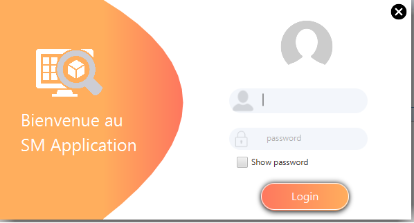
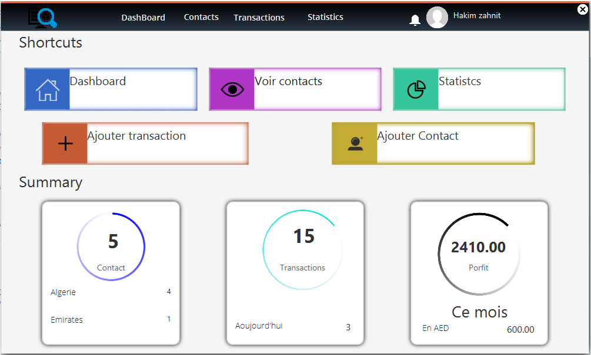

# Transaction History Management System

## Description

- This is a JavaFx project created using `Java` with `JavaFx` plugin with `Scene builder`.  
- The project purpose is to follow up the transactions (**Buy/Sell**) that the admin has made with his clients in the two currencices:(**based on the client needs**):
  1. Algerian dinar. 
  2. Arabic Emirates dinar 
- Also, the app can calculate the total profit of the admin per month or per year with a simple and easy **GUI** to read.

## Table of Contents (Optional)

- [Installation](#installation)
- [Usage](#usage)
- [License](#license)

## Installation

- Java(8.x or more).  
- JavaFX plugin.  
- [opencsv lib](dist/lib/opencsv-3.8.jar). 
- NetBeans IDE.

## Usage

This app can be used to anyone who wants to follow his transactions made with the clients and estimate his profit monthly.  
To run the project please follow these steps:  

- Run the `System_Managmnet.java` file.  
- The first interface will be the login form.  
  
- In order to get into the app you need to enter the correct username and password coordinates: 
  - for the username: `Admin`.  
  - for the password: `Admin`.  
- First thing you will see is the `Dashboard` interface which contains all the necessary informations that the admin needs to know.  
  
- The `Contacts` part will show you all your registered contacts with a bookmark of their information. Also, there is a filter section in order to facilitate the search for a specific client. You can also get access to the client profile to see other information. 
  
- The `Add Contact` part will allow to add any contact you want. Simply fill in the necessary information for that client( not all the fields need to be filled in) and click `Save`. 
  
- The `Profile` part is responsable for showing the entire client transaction history along with all his information. Also, you can modify any transaction that happened.And you can add a new transaction in the profile pane. 
  
- The `Notifications` part is the interface that shows to admin all actions that happened within the system. 
  
- The most important part of this system is the `stats` part because this interface will calculate and make the administrator keep track of his profit monthly or annually for both currencies (_DZ/AED_).
  

## License
